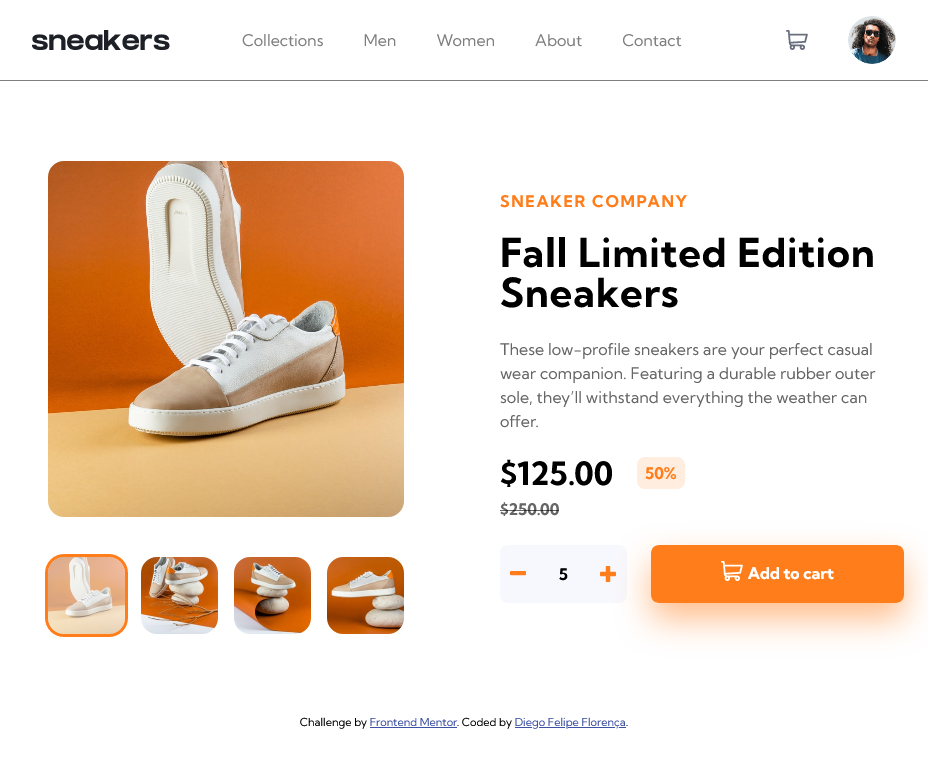

# Frontend Mentor - E-commerce product page solution

This is a solution to the [E-commerce product page challenge on Frontend Mentor](https://www.frontendmentor.io/challenges/ecommerce-product-page-UPsZ9MJp6). Frontend Mentor challenges help you improve your coding skills by building realistic projects.

## Table of contents

- [Frontend Mentor - E-commerce product page solution](#frontend-mentor---e-commerce-product-page-solution)
  - [Table of contents](#table-of-contents)
  - [Overview](#overview)
    - [The challenge](#the-challenge)
    - [Screenshot](#screenshot)
    - [Links](#links)
  - [My process](#my-process)
    - [Built with](#built-with)
    - [What I learned](#what-i-learned)
    - [Continued development](#continued-development)
    - [Useful resources](#useful-resources)
  - [Author](#author)
  - [Acknowledgments](#acknowledgments)

**Note: Delete this note and update the table of contents based on what sections you keep.**

## Overview

### The challenge

Users should be able to:

- View the optimal layout for the site depending on their device's screen size
- See hover states for all interactive elements on the page
- Open a lightbox gallery by clicking on the large product image
- Switch the large product image by clicking on the small thumbnail images
- Add items to the cart
- View the cart and remove items from it

### Screenshot

|      Mobile Version       |          Menu openned          |
| :-----------------------: | :----------------------------: |
|  |  |

###

_Desktop Version_

### Links

- Solution URL: [GitHub Repository](https://github.com/diegoflorenca/FM-E-commerce-product-page)
- Live Site URL: [GitHub Pages](https://diegoflorenca.github.io/FM-E-commerce-product-page/)
- Frontend Mentor: [Solution on FM](https://www.frontendmentor.io/solutions/ecommerce-product-page-htmlcss-and-javascript-fvRR9RZBu)

## My process

### Built with

- Semantic HTML5 markup
- CSS custom properties
- Flexbox
- CSS Grid
- Mobile-first workflow

### What I learned

I learnt Responsive Layout using pure CSS with great learning experience while making this project and also I did work a lot with JavaScript.

### Continued development

JavaScript, ReactJS, Python Flask, Figma, Unity

### Useful resources

- [Basic Concepts of grid layout](https://developer.mozilla.org/en-US/docs/Web/CSS/CSS_Grid_Layout/Basic_Concepts_of_Grid_Layout) - This helped me understand how GRID works and how to use it.
- [Responsive design made easy](https://www.youtube.com/watch?v=bn-DQCifeQQ) - This Kevin Powell video is a great resource to understand de concepts of responsive designs and how to do it right.

## Author

<!-- - Website - [Diego Felipe Florença](https://www.your-site.com) -->

- Linkedin - [Diego Felipe Florença](https://www.linkedin.com/in/diegoflorenca/)
- Frontend Mentor - [@diegoflorenca](https://www.frontendmentor.io/profile/diegoflorenca)
<!-- - Twitter - [@yourusername](https://www.twitter.com/yourusername) -->

## Acknowledgments

This challenge let me practice Grid and Flex positioning. I have much to improve but, I'm getting better every time. At first, I thought the javascript portion would be super simple but, the product cart with quantities gave me some trouble. After studying React a bit more, I will try this challenge again.
